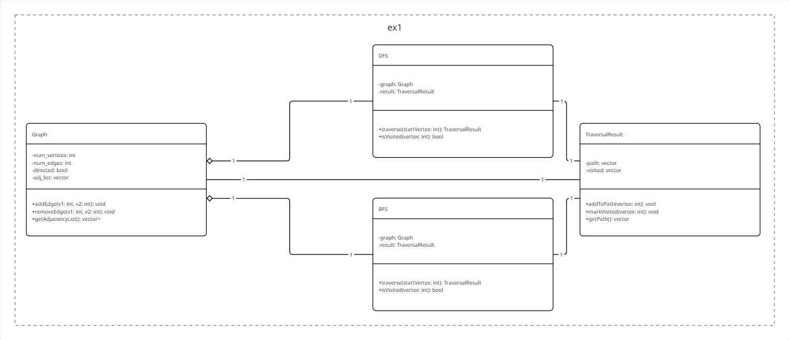

# Lab 1: Graph Traversal Algorithms

## 1. Overview

This project implements a basic graph data structure along with two fundamental graph traversal algorithms: Depth-First Search (DFS) and Breadth-First Search (BFS). The structure is designed to be simple and provides a clear separation of concerns between the graph representation and the algorithms that operate on it.

The main components are:
* **Graph**: A class representing a graph using an adjacency list.
* **TraversalResult**: A helper class to store the results of a traversal (visit order and parent tree).
* **DFS**: A class that performs a Depth-First Search on a given graph.
* **BFS**: A class that performs a Breadth-First Search on a given graph.

## 2. Class Diagram

The following diagram illustrates the relationship between the main classes in this project.
```bash 
#TODO: fix uml 
``` 



---

## Shared compoemnts 

### `Graph`
* Represents a graph (either directed or undirected).
* Uses an adjacency list (`vector<vector<int>>`) for storage.
* Keeps track of the number of vertices (`num_vertices`) and edges (`num_edges`).

## Ex_1 Compoments

### `TraversalResult`
* A simple data structure (struct/class) used as a return type for the traversal algorithms.
* `visit_order`: Stores the nodes in the order they were first visited.
* `parent_tree`: Stores the parent of each node in the traversal tree, allowing path reconstruction.

### `DFS`
* A "visitor" class that performs a Depth-First Search.
* It is initialized with a reference to a `Graph` object.
* The `run(int start_node)` method executes the search starting from a given node and returns a `TraversalResult`.
* Uses a private recursive helper function (`dfs_recursive`) to perform the traversal.

### `BFS`
* A "visitor" class that performs a Breadth-First Search.
* It is initialized with a reference to a `Graph` object.
* The `run(int start_node)` method executes the search starting from a given node and returns a `TraversalResult`.
* Uses a private iterative method (`bfs_iterative`) implementing a queue to manage the search.

## Ex_2 compometns 

### `TopoSortResult`
* A simple data structure (struct/class) used as a return type for the `TopoSort` algorithm.
* `has_cycle`: A boolean flag, set to `true` if a directed cycle is detected in the graph.
* `top_order`: A list (`std::list<int>`) storing the nodes in topologically sorted order. This list is only valid if `has_cycle` is `false`.

### `TopoSort`
* A "visitor" class that performs a topological sort, designed specifically for **directed graphs**.
* It is initialized with a reference to a `Graph` object.
* The `run()` method executes the algorithm across the entire graph (handling disconnected components) and returns a `TopoSortResult`.
* It inherently **detects directed cycles** as part of the algorithm. A topological sort is only possible if no cycles are found.
* Uses a private recursive helper function (`topo_dfs_recursive`) that employs a 3-state coloring (unvisited, visiting, visited) to track node status, detect back-edges (cycles), and build the sorted list.